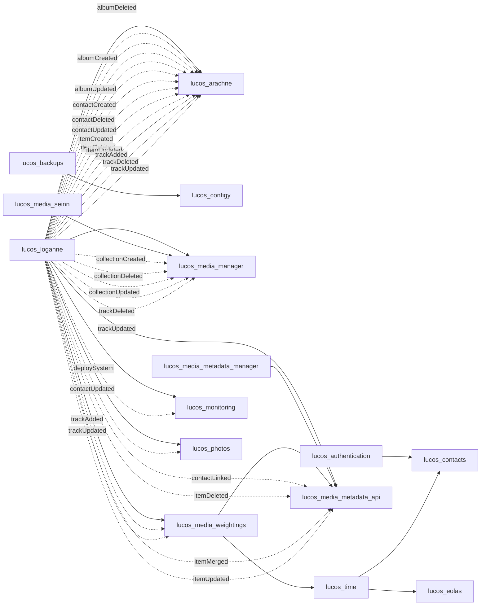

<!-- GENERATED first-cut — lucos_repos ADR-0006, produced by prototype-generator.py on 2026-06-14.
     Connected core only (systems with at least one edge); the full 41-node graph is a hairball in Mermaid —
     see model.dsl for the model of record. Solid = sync (/_info dependsOn); dotted = async (loganne events). -->
# lucOS estate — connected core (generated)

